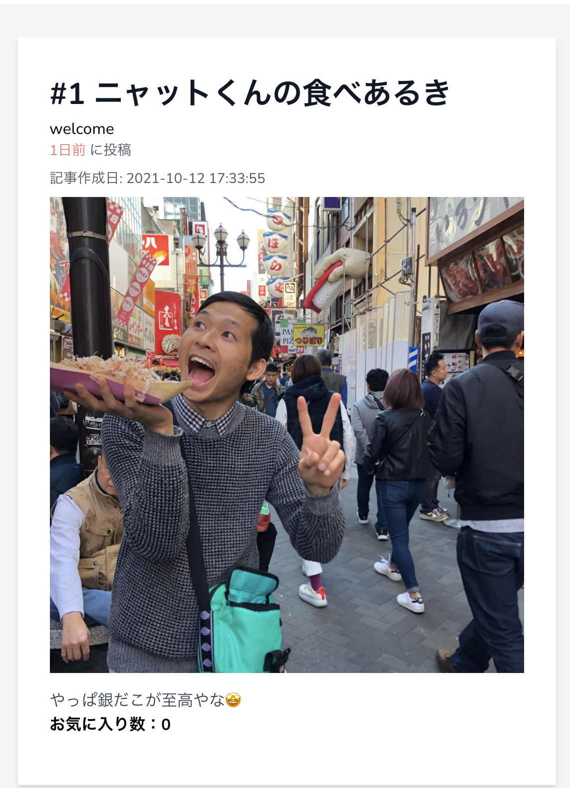
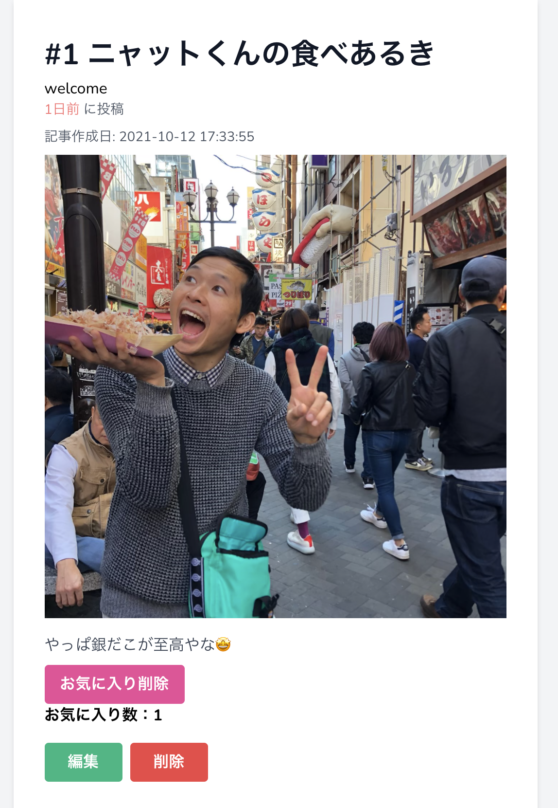
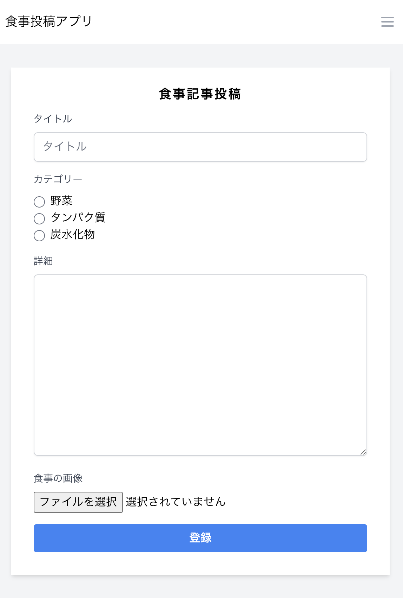
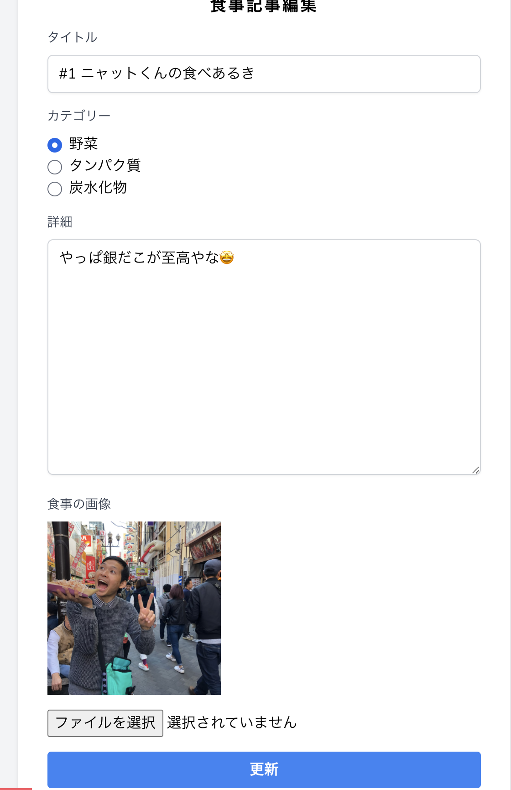
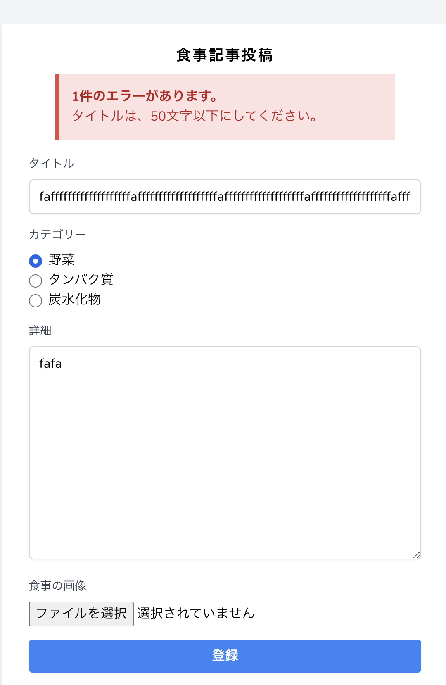
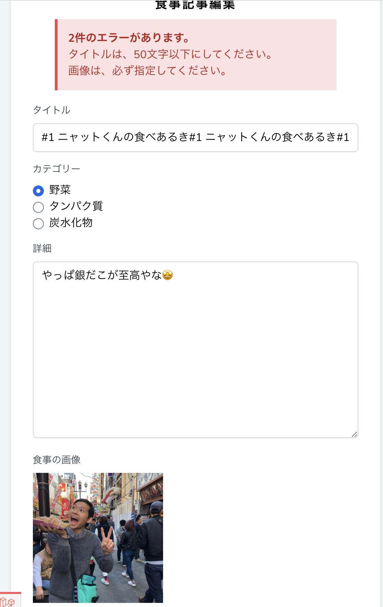

# 食事投稿アプリ

### 実装機能

- CRUD
食事がCRUDできるようになっています
バリデーションも実装済
- ファイルアップロード
画像を、ファイルアップロードできるようにしました｡
ファイルアップロードするとき、画面上にプレビュー画像が表示されるようにしました
アップロードした画像は、/storage/app/public/all_image配下に保存
- 記事に対しお気に入りできるようにしました｡
一つの記事に対し何度もお気に入りできないようにしました｡

### 画面

* 一覧画面

* 詳細画面/Guest

* 詳細画面/login

* 登録画面

* 編集画面

* エラー登録画面

* エラー編集画面

